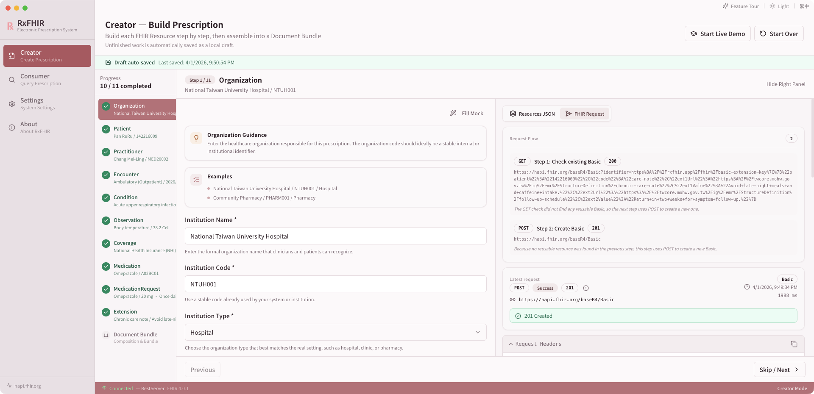
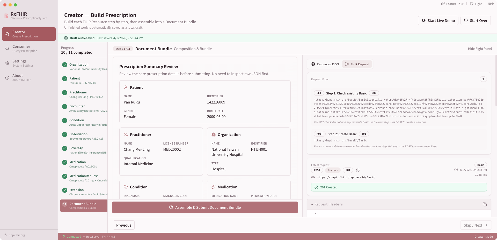
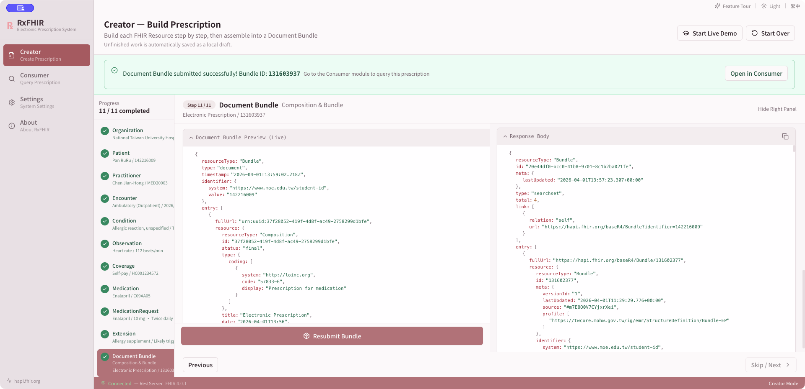
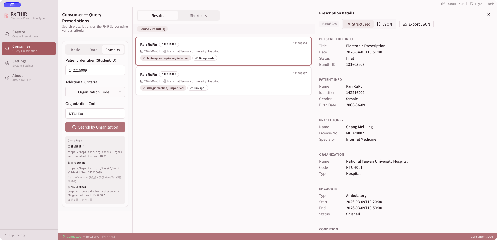

# RxFHIR

> ℞ + FHIR = RxFHIR — A desktop application for Taiwan Core electronic prescription profiles

<p align="center">
  
  
  
  
</p>

<p align="center">
  
  
  
  
  
</p>

<p align="center">
  
  
  
  
</p>

<p align="center">
  <strong>Ready-to-run desktop builds — no source code required:</strong>
</p>

<p align="center">
  <a href="https://github.com/swiftruru/rx-fhir/releases/latest">
    
  </a>
  &nbsp;
  <a href="https://github.com/swiftruru/rx-fhir/releases/latest">
    
  </a>
  &nbsp;
  <a href="https://github.com/swiftruru/rx-fhir/releases/latest">
    
  </a>
</p>

<p align="center">
  <sub>All three platforms are supported. Click any badge above to go to the latest release.</sub>
</p>

---

A cross-platform desktop application built with Electron + React for creating and querying FHIR R4 electronic prescriptions, based on the Taiwan Ministry of Health and Welfare EMR-IG 2.5 context.

This README reflects the **current implementation** in the repository. When documentation and behavior differ, the source code is the source of truth.

---

## Architecture

The current renderer is organized into four explicit layers:

- `src/renderer/app`: app shell, routes, dialogs, global orchestration, and app-level stores
- `src/renderer/features`: feature-owned UI, hooks, libs, and stores for Creator, Consumer, History, Settings, and About
- `src/renderer/domain`: reusable FHIR business logic and request rules
- `src/renderer/shared`: shared UI primitives, shared hooks, shared stores, and cross-feature utilities

Electron-native concerns stay in `src/main`, and stable cross-process contracts live in `src/shared/contracts`. For the fuller structure and boundary rules, see [docs/architecture.md](docs/architecture.md).

---

## Academic Context / 課程背景

本專案為修讀 **醫療資訊系統基礎**（Introduction to Healthcare Information Systems）課程之成果作品。  
This application was developed as a course project for **Introduction to Healthcare Information Systems**.

| Field / 欄位 | 中文 | English |
| --- | --- | --- |
| Author / 作者 | 潘昱如 | Yu-Ru Pan |
| Affiliation / 學校 | 國立臺北護理健康大學 | National Taipei University of Nursing and Health Sciences |
| Department / 系所 | 資訊管理系所 | Department of Information Management |
| Course / 課程 | 醫療資訊系統基礎 | Introduction to Healthcare Information Systems |

### Advisors / 指導老師

以下依英文姓名字母排序，排名不分先後。  
Listed in alphabetical order by English name; no ranking implied.

- Chen-Tsung Kuo（郭振宗老師）
- Chen-Yueh Lien（連中岳老師）
- Siang-Hao Lee（李祥豪老師）

---

## Features

### Creator Module

Step-by-step wizard to build and submit a FHIR Document Bundle:

<p align="center">
  
  <br />
  <em>Creator workspace with the step-by-step prescription workflow.</em>
</p>

| Step | Resource | Description |
|------|----------|-------------|
| 1 | Organization | Medical institution |
| 2 | Patient | Patient demographics |
| 3 | Practitioner | Physician info |
| 4 | Encounter | Visit context |
| 5 | Condition | Diagnosis (ICD-10) |
| 6 | Observation | Lab / exam results |
| 7 | Coverage | Insurance |
| 8 | Medication | Drug (ATC / NHI code) |
| 9 | MedicationRequest | Prescription order |
| 10 | Extension (`Basic`) | Supplemental extension payload |
| 11 | Composition | Document assembly + bundle submission |

Current Creator capabilities:

- Stepper-based workflow with per-step progress, sidebar completion summaries, and current-step header summaries
- Form validation via `react-hook-form` + `zod`
- Scenario-based Mock Data System for demos and testing, with coherent multi-resource mock packs instead of isolated per-form samples
- Shared `Fill Mock` flow across Creator steps, so patient, institution, physician, encounter, diagnosis, medication, and composition stay internally consistent within the same scenario
- The Patient step now starts from a designated primary demo patient on first fill, then rotates through additional scenarios on later fills
- Mock filling is now locale-aware, so `zh-TW` fills Chinese demo content and `en` fills the corresponding English version of the same scenario
- Prescription Templates can preload common outpatient scenarios into all Creator draft steps from a compact toolbar action without taking over the workspace
- Revisiting completed steps restores current resource values back into the form
- Unfinished Creator drafts are auto-saved locally and restored on next launch
- Re-submitting completed steps updates existing FHIR resources instead of duplicating them
- Coverage and Medication reuse existing server-side resources by identifier or code when possible, reducing duplicate `POST` failures on public HAPI servers
- Encounter, Condition, Observation, MedicationRequest, and Extension now also reuse existing server-side resources through stable identifiers on public HAPI servers
- When an existing server-side resource is reused, the UI now shows an explicit reuse message instead of only a generic success state
- Step success / reuse alerts now remain visible when you leave a completed step and come back later
- Human-friendly FHIR `OperationOutcome` messages are shown first, with expandable raw error details for troubleshooting
- Most Creator forms now include consistent inline guide cards with examples and field-level hints for identifiers, encounter timing, ICD-10, LOINC, insurance, medication coding, medication route, and supplemental extensions
- Keyboard accessibility is improved with stepper shortcuts, clearer focus-visible states, and an app-wide shortcut system with a help dialog plus customizable bindings in Settings
- Live Demo mode provides a guided, step-by-step teaching flow with manual-first pacing, optional autoplay, human-like typed mock input, and in-view scrolling so fields and submit actions are demonstrated on screen instead of updating off-screen
- Feature Showcase mode provides a spotlight-style product tour with adjacent coaching panels, highlighted targets, darker background dimming, and polished product-style transitions; the tour now covers 17 steps including a dedicated export step (step 12) and a side-by-side Bundle Diff step (step 13) with a live comparison dialog open during the coaching panel; showcase runs never write mock records into the user's submission history; stopping the showcase restores the user's real workspace immediately so later locale changes do not reapply demo data; any in-progress Live Demo is stopped before showcase begins to prevent mock FHIR submissions from appearing as error toasts during the tour
- Live JSON preview of created resources
- JSON preview now follows the active light / dark theme instead of staying fixed in a dark-only style
- JSON preview now includes a compact toolbar with font-size switching, collapse, and all/latest-resource toggles for demos
- The Creator info panel can switch between resource JSON and a Postman-style FHIR request inspector showing request flow, method, URL, headers, body, and response details
- The Creator info panel is now resizable like a desktop split view, with horizontal resizing on wide layouts and vertical resizing when the panel moves below the form on narrower windows
- The FHIR request inspector now includes clickable URLs, request-flow notes, method explanations, and a compact `GET / POST / PUT` quick guide in the empty state
- FHIR request and response bodies now default to `Raw`, and Live Demo can temporarily collapse the coaching card to spotlight the request flow after each server submission
- **FHIR Request Inspector Postman export**: when the request history has entries, a one-click export button generates a Postman Collection v2.1 from the captured request history (POST/PUT resource creation, GET check and search requests), with `{{fhirBaseUrl}}` variable substitution and decoded query parameters — no server probing required
- Final submission now includes a structured prescription summary review card before bundle assembly
- Composition-first, then document bundle submission
- The final Creator step can export the assembled FHIR Bundle as local JSON
- After a successful bundle submission, Creator can jump directly into Consumer, auto-run the query, and focus the newly created bundle
- Recent submission history stored locally for later query prefill

<table>
  <tr>
    <td align="center" width="50%">
      
      <br />
      <em>JSON preview and Postman-style FHIR request inspector.</em>
    </td>
    <td align="center" width="50%">
      
      <br />
      <em>Composition review and final Document Bundle assembly.</em>
    </td>
  </tr>
</table>

### Consumer Module

Search and inspect FHIR Bundles on the configured server:

<p align="center">
  
  <br />
  <em>Consumer workspace for query, shortcuts, results, and prescription review.</em>
</p>

- **Basic search**: patient identifier or patient name
- **Date search**: patient identifier + bundle date
- **Complex search**: patient identifier + author or organization
- The left panel now focuses on search input only, so the query form remains visible even on narrower windows
- The middle panel now includes three tabs — `Results`, `Shortcuts`, and `History` — so recent submissions, saved searches, and full query history are always one click away even after a search has been run
- The **History tab** shows all past Document Bundle submissions and saved searches side by side; clicking a submission record fetches the original bundle from the server and opens it in the detail panel on the right, with no need to re-run a search
- If a submission's bundle is no longer on the server (e.g. public HAPI resets data periodically), Consumer shows a contextual "Search by Identifier" toast action that auto-fills and runs the basic search as a fallback
- History submissions only show completed Document Bundle submissions; intermediate resource-creation records are hidden so the list stays focused on full prescriptions
- Saved searches in the History tab can be re-run, pinned, unpinned, and deleted without navigating away from Consumer
- Consumer can import local FHIR Bundle JSON files for offline or ad hoc inspection without querying the server
- Query examples and local Bundle import are now grouped under `Shortcuts`, keeping the main search form focused on real search tasks
- Recent-record magnifier prefills the active search tab instead of forcing a return to basic search
- Complex search prefills patient identifier and available author / organization context from local submission history, and can backfill missing context by re-reading a stored bundle when needed
- Search conditions are now stored locally as recent searches, and any search can be pinned into favorites for quick reruns
- The submission statistics strip in the Shortcuts tab is collapsible to a single summary row showing total, bundle count, patient count, and organization count at a glance
- Recent submissions and saved searches are shown as separate helper sections with clearer visual hierarchy
- Query URL display and multi-step trace for compatibility workarounds, with clickable links that open in the system browser
- Query-step labels and workaround notes now follow the current UI language instead of staying fixed in Chinese after a locale switch
- After each search, the UI shows both the **ideal FHIR R4 standard query** (e.g. `composition.subject:Patient.identifier`) and the **actual workaround query** used, with plain-language notes explaining why the standard form is not used on public HAPI servers
- First query example in all three modes (basic / date / complex) always starts with the primary demo patient (`isPrimaryDemo`) for consistent demo flow
- Result list with patient, organization, diagnosis, and medication summary
- Empty-result states now explain likely causes and suggest next actions based on the actual search mode
- Prescription detail view now uses a fixed-width detail pane with a clearer `Structured / JSON` toggle in the header
- Structured detail view and raw JSON viewer — the JSON panel stays within the detail pane width and scrolls internally; switching results auto-expands the viewer
- Bundle detail now includes an **Export dropdown** with three formats: FHIR JSON, Postman Collection v2.1, and HTML report
- **Postman Collection export** probes the FHIR server for each resource to determine whether PUT or POST is correct (using HAPI-2840 duplicate detection and identifier-based search), then generates a ready-to-run collection with four query requests covering basic, date, and complex search modes, each with a client-side filter test script that mirrors the app's own workaround logic; a cancel button appears during server probing so long-running exports can be aborted without showing an error
- **HTML report export** generates a self-contained, printable prescription summary with embedded CSS, including: a clinical timeline showing key clinical events in chronological order; a medication summary table before the detailed cards; Observation lab value badges (Normal / High / Low) derived from reference ranges; a color-coded Composition status banner (final / draft / amended / entered-in-error); a global full-text search bar with ↑↓ navigation and match count; and a print layout with A4 margins and fixed page header/footer
- **Date search** now correctly filters by `Composition.date` (prescription date) instead of `Bundle.timestamp` (submission time), using the same fetch-then-filter workaround as organization and author complex searches
- Date query example now pre-fills with the actual `Composition.date` from the most recently submitted bundle, falling back to the most recently used date search, so the example always matches a real record on the server
- **Composition chain search**: name and identifier searches now include a final step that looks up `Composition` resources linked to matched patients and retrieves their parent Bundles via `Bundle?composition=`, so prescriptions submitted from any FHIR client (e.g. Postman, third-party apps) are discoverable — not just those created with RxFHIR's own identifier convention
- **Cancel search**: an `×` icon button appears next to the submit button during an active query; clicking it aborts all in-flight HTTP requests immediately via `AbortController` and shows a distinct cancelled state in the results panel
- **Result sort and filter**: a sort dropdown (Newest First / Oldest First / Name A→Z / Name Z→A) and a keyword filter input appear in the results header once results are loaded; the filter matches against patient name, identifier, and organization simultaneously; the filter resets automatically on each new search while the sort preference is retained across queries; a "no match" empty state appears when the filter eliminates all results
- **Search UX improvements**: results are cleared at the start of each new query so stale data never misleads; a spinner with animated skeleton cards appears in the results panel immediately; all search-mode tabs and the middle Results / Shortcuts tabs are disabled while a query is running to prevent accidental tab switches mid-search
- **Navigation guard**: if the user tries to navigate to another page while a search is in progress, a toast with an optional "Leave Anyway" action appears instead of silently aborting the search
- **Consumer search isolation**: Consumer queries no longer appear in Creator's FHIR Request Inspector panel — each module tags its HTTP requests with the originating route, and the Creator inspector filters to its own entries only
- **Result CSV export**: the results toolbar includes a one-click CSV export button that generates an RFC 4180-compliant file with UTF-8 BOM for Excel and Numbers compatibility; only the currently filtered and sorted results are exported, and the filename includes the export date
- **Side-by-side Bundle Diff**: after selecting a prescription, every other result card shows a labeled "Compare" button (icon + text, outline style for discoverability); clicking it opens a full-screen diff dialog with all structured fields — patient, practitioner, organization, encounter, condition, observation, coverage, and medication — aligned side by side; differing fields are highlighted in amber, identical ones are neutral, and a badge shows the total difference count; a Swap A/B button flips the comparison direction without reopening the dialog
- Feature Showcase now clears Activity Center notification history on start and restores it on exit, keeping showcase runs visually clean; showcase runs no longer write mock records into the user's submission history store
- **FHIR 410 Gone recovery**: when HAPI's search index points to a soft-deleted resource and the subsequent `fetchResourceById` receives 410, the client now automatically issues a `PUT` to the same ID to resurrect it — eliminating the "Resource was deleted" error that previously surfaced during Creator Extension and other resource steps on the public HAPI server
- Supports Creator-to-Consumer handoff with automatic query prefill, auto-search, and newly created bundle focus

### Settings and App Shell

- FHIR Server URL configuration with preset servers
- Live server health check via `/metadata`
- Testing the currently active server now immediately syncs the global connection status shown in Settings and the status bar
- A dedicated Keyboard Shortcuts settings tab lets users inspect active bindings, customize selected shortcuts, detect conflicts, and restore defaults
- Accessibility preferences now include motion behavior, text scale, full-app zoom, and enhanced keyboard focus visibility
- Preference import / export is now available from Settings, including app preferences and shortcut overrides
- Settings now include search, dirty markers, and per-section reset actions for faster maintenance
- Command Palette provides a searchable action layer for navigation, settings actions, quick-start entry points, and recent local bundle files
- Activity Center now keeps a local notification history with unread state and filter tabs instead of relying on transient toasts only
- First-run onboarding and task-based Quick Start scenarios now provide guided entry points into Creator, Consumer, and Accessibility settings, with a blank Creator starting point that no longer auto-loads sample data unexpectedly
- The macOS title-bar utility controls now use a more consistent spacing model, including a cleaner unread badge for Activity Center
- Electron window size and position are now persisted locally between launches
- App shell accessibility now includes a skip link, route-aware focus management, screen-reader announcements, and clearer status semantics
- High-contrast, forced-colors, stronger disabled states, and clearer selected-state indicators are now supported across shared UI components
- Light / Dark / System theme toggle
- `zh-TW` / `en` language toggle
- Embedded `Noto Sans TC` UI font for more consistent offline typography, especially on Windows
- Custom macOS app naming, icon, and About window
- The sidebar logo and top toolbar are now platform-aware: the 28 px macOS traffic-light drag zone is rendered only on macOS, so the `℞` logo and utility controls are correctly positioned on Windows and Linux without being clipped or offset by an unnecessary spacer
- The About page is redesigned with a Hero block (app icon, dynamic version number, tagline), a separate academic background card (author, institution, advisors), and a technical info card with links to the GitHub repository and personal homepage; the macOS native About window version is now read dynamically from the app instead of being hardcoded
- The About page includes an **App Updates** section that checks GitHub Releases for newer versions; a manual "Check for Updates" button shows one of three states (up-to-date, update available, or check failed); when a new version is found a link to the Releases page is shown; on app startup a background check runs after 5 seconds and adds a dot indicator next to the version number if an update is available — all platforms use the same lightweight strategy (GitHub public API + semver compare, no code signing or auto-install required); when a new version is detected, three actions are available: **View on GitHub Releases** (opens the release page), **Remind Me Later** (dismisses the notification without recording anything — the prompt reappears on next launch), and **Skip This Version** (records the version to a local file so that specific version is never prompted again, while newer future versions still notify)

### UX Highlights

- Creator now shows draft save state more explicitly; draft auto-save ensures no work is lost when navigating away, so navigation is no longer blocked by a confirmation dialog
- Creator also keeps a post-submission diff summary so users can quickly see what changed since the last successful bundle submission
- Creator layout is now more responsive on narrower desktop windows, while keeping the stepper and info panel visible in desktop-style split layouts
- Consumer now supports both native file import and drag-and-drop Bundle inspection in the real Electron window
- Consumer quick-start, recent files, recent submissions, and saved searches now work together as a more complete desktop query workspace
- Toast feedback is now backed by a local Activity Center instead of disappearing without history
- Command Palette, onboarding, and Quick Start scenarios provide a clearer path for both first-time users and power users

### Accessibility Highlights

- Keyboard-first navigation across Creator, Consumer, Settings, dialogs, and shortcut help
- Route-aware focus restoration, visible focus indicators, and an optional enhanced focus mode
- Screen-reader support for page changes, async status updates, form errors, search results, stepper progress, and shortcut editing feedback
- Reduced-motion support that still preserves the typed Live Demo rhythm, with user control through Settings
- Text scale and Electron-level UI zoom preferences stored locally
- JSON Viewer and FHIR Request Inspector now support readable summary mode in addition to raw JSON
- Accessibility roadmap, checklist, component rules, and manual test docs are included under `docs/accessibility/`
- UX planning, manual testing, and Electron debug tooling docs are included under `docs/ux/`

---

## Search Behavior

The current search implementation is optimized for public HAPI FHIR server compatibility. The UI displays both the **ideal FHIR R4 standard query** and the **actual workaround query** side by side after every search, so the gap between the spec and the implementation is always visible.

### Ideal FHIR R4 Standard Queries

| Mode | UI Input | FHIR R4 Standard Query |
|------|----------|------------------------|
| Basic | identifier | `GET /Bundle?composition.subject:Patient.identifier={value}` |
| Basic | name | `GET /Bundle?composition.subject:Patient.name={value}` |
| Date | identifier + date | `GET /Bundle?composition.subject:Patient.identifier={id}&composition.date={date}` |
| Complex | identifier + author | `GET /Bundle?composition.subject:Patient.identifier={id}&composition.author:Practitioner.name={name}` |
| Complex | identifier + organization | `GET /Bundle?composition.subject:Patient.identifier={id}&composition.custodian:Organization.identifier={orgId}` |

### Actual Implementation (HAPI Workaround)

Public HAPI FHIR servers do not fully support chained search on `Bundle`. The app falls back to equivalent queries:

| Mode | UI Input | Implemented Query |
|------|----------|-------------------|
| Basic | identifier | `GET /Bundle?identifier={value}` (patient identifier mapped to `Bundle.identifier`) |
| Basic | name | Step A: `GET /Patient?name={value}` → `GET /Bundle?identifier={id}` per matched patient; Step B fallback: `GET /Bundle?_count=N` → client-side name filter; Step C: Composition chain (see below) |
| Date | identifier + date | fetch bundles by identifier → client-side filter on `Composition.date` prefix (`Bundle.timestamp` ≠ `Composition.date`) |
| Complex | identifier + author | fetch bundles by identifier → client-side filter on `Composition.author` / `Practitioner.name` |
| Complex | identifier + organization | resolve organization by identifier → fetch bundles by identifier → client-side filter on `Composition.custodian` |

#### Composition Chain (cross-app bundle discovery)

For name and identifier searches, after the identifier-based steps a final **Composition chain** step runs:

1. `GET /Composition?subject=Patient/{id}` — find all Compositions linked to the matched patient
2. `GET /Bundle?composition=Composition/{id}` — retrieve the parent document Bundle for each Composition

This discovers prescriptions submitted from **any FHIR client** (Postman, third-party apps, etc.), not only those that follow RxFHIR's `Bundle.identifier` convention. Results from all steps are merged and deduplicated by Bundle ID, with locally submitted bundles sorted first.

---

## Mock Data System

The current repository now uses a typed, scenario-driven mock data design instead of a single flat demo pool.

- Mock data is organized into coherent scenario packs that span the full Creator flow, from `Organization` through `Composition`
- The first `Patient` mock fill uses a designated primary demo patient, while later fills can rotate through additional scenarios
- Mock data is now locale-aware: the same scenario can resolve to `zh-TW` or `en` text content without changing identifiers, codes, dates, or other shared fields
- Scenario packs cover common outpatient, chronic disease, acute visit, emergency, pediatric, search-demo, and optional-field situations
- Prescription Templates are generated from the same scenario source, so common outpatient presets reuse the exact same typed data structure as Creator `Fill Mock`
- Consumer basic/date/complex query examples are derived from the same scenario source, reducing drift between Creator demos and Consumer search helpers
- Validation helpers are included to keep scenario IDs unique and ensure each full scenario remains structurally complete

---

## Tech Stack

| Layer | Technology |
|-------|-----------|
| Framework | Electron 33 |
| Frontend | React 18 + TypeScript |
| Build | electron-vite + Vite 5 |
| UI | Tailwind CSS + shadcn/ui (Radix UI) |
| Typography | Embedded Noto Sans TC |
| State | Zustand |
| Forms | react-hook-form + zod |
| i18n | i18next + react-i18next |
| FHIR Types | `@types/fhir` (R4) |
| Routing | React Router v6 (`HashRouter`) |
| Packaging | electron-builder |

---

## FHIR Profiles

Based on [TW Core EMR-IG Electronic Prescription 2.5](https://twcore.mohw.gov.tw/ig/emr/profiles.html):

- `Composition-EP`
- `Patient-EP`
- `Organization-EP`
- `Practitioner-EP`
- `Encounter-EP`
- `Condition-EP`
- `Observation-EP`
- `Coverage-EP`
- `Medication-EP`
- `MedicationRequest-EP`

The current UI also includes an extra `Extension` step implemented with a `Basic` resource for supplemental data capture.

---

## Getting Started

If you only want to use RxFHIR, you do not need to build from source. Download the latest desktop app from GitHub Releases:

### Download Builds

- Latest Release: <https://github.com/swiftruru/rx-fhir/releases/latest>
- Windows: `RxFHIR-Windows-Setup-...exe` or `RxFHIR-Windows-Portable-...exe`
- macOS: `RxFHIR-macOS-...dmg`
- Linux: `RxFHIR-Linux-...AppImage` or `RxFHIR-Linux-...deb`
- Avoid `Source code (zip)` and `Source code (tar.gz)` if you want the runnable desktop app

If you want to develop RxFHIR locally, continue with the setup steps below.

### Prerequisites

- Node.js 20+
- macOS recommended for local development

### Install and Run

```bash
npm install
npm run dev
```

### Type Check

```bash
npm run typecheck
```

### Unit Tests

```bash
npm test
```

### Accessibility Smoke Check

```bash
npm run a11y:check
```

### Electron UX Smoke Check

Requires a running Electron debug instance:

```bash
npm run ux:electron:smoke
```

### Electron UX Verify

Runs `build`, launches a clean Electron test instance, performs the repo's Electron UX smoke checks, then closes it:

```bash
npm run ux:electron:verify -- --skip-build
```

### Electron UI Automation

Runs the Playwright-based Electron UI suite with mocked FHIR responses and isolated app state:

```bash
npm run test:ui
```

For local demo mode:

```bash
npm run test:ui:headed
```

To inspect the HTML report after a run:

```bash
npm run test:ui:report
```

More details:

- [docs/testing/ui-automation.md](docs/testing/ui-automation.md)
- [docs/testing/ui-automation-demo-script.md](docs/testing/ui-automation-demo-script.md)
- [`.github/workflows/ui-automation.yml`](.github/workflows/ui-automation.yml)

Current UI automation coverage includes:

- About update state branches and external-link bridge flows
- app shell and route navigation
- Creator draft restore and Creator-to-Consumer submit handoff
- Consumer local Bundle import and recent-record maintenance flows
- Consumer basic, date, and complex search modes
- Consumer mocked empty / error / cancelled states and load-more pagination
- Consumer history, submission-history, and saved-search flows
- Settings accessibility persistence and FHIR server settings flow

The current UI automation scope is intentionally treated as the stable v1
delivery boundary for demo/classroom use. See
[`docs/testing/ui-automation.md`](docs/testing/ui-automation.md) for the
current scope and intentionally out-of-scope items.

### Electron CDP Eval

Evaluate a quick expression inside the live Electron renderer:

```bash
npm run cdp:eval -- "location.hash"
```

### Build

```bash
npm run build:mac
npm run build:win
npm run build:linux
```

Artifact naming now follows explicit platform labels:

- Windows installer: `RxFHIR-Windows-Setup-<version>.exe`
- Windows portable executable: `RxFHIR-Windows-Portable-<version>.exe`
- macOS disk image: `RxFHIR-macOS-<version>.dmg`
- Linux AppImage: `RxFHIR-Linux-<version>.AppImage`
- Linux deb package: `RxFHIR-Linux-<version>.deb`

---

## Project Structure

```text
src/
├── main/
│   ├── index.ts
│   ├── preload.ts
│   ├── ipc/           # Typed Electron IPC registration
│   ├── services/      # Window lifecycle, menu, file, and desktop services
│   └── updater/       # Update-check IPC helpers
├── renderer/
│   ├── App.tsx
│   ├── app/           # App shell, routes, dialogs, app-level stores
│   ├── domain/        # FHIR domain logic and pure business rules
│   ├── features/      # Creator / Consumer / History / Settings / About
│   ├── shared/        # Shared UI, hooks, stores, utilities
│   ├── demo/          # Live Demo definitions
│   ├── i18n/
│   ├── mocks/         # Typed scenario-based mock data + query examples
│   ├── services/      # Renderer-facing service facades
│   ├── showcase/      # Feature Showcase scripts and snapshot builders
│   ├── styles/
│   └── types/
└── shared/
    └── contracts/     # Stable cross-process and shared domain contracts
docs/
├── architecture.md    # Current architecture and ownership rules
├── accessibility/      # A11y roadmap, checklist, manual testing
├── refactor-followups.md
├── screenshots/        # Product screenshots used in docs
└── ux/                 # UX planning, manual testing, Electron debug notes
scripts/
├── a11y-smoke-check.mjs
├── electron-cdp-eval.mjs
├── electron-ux-smoke.mjs
├── electron-ux-verify.mjs
└── run-electron-vite.mjs
```

---

## Quality Status

Current repository quality signals:

- TypeScript typecheck is available and passes
- Vitest unit tests are available and pass
- Accessibility smoke check is available and passes
- Electron UX smoke and end-to-end verify scripts are available and pass locally
- Playwright Electron UI automation is available and currently passes locally with 22 tests
- GitHub Actions runs a dedicated `UI Automation` workflow for the Electron UI suite
- Production build is available and passes locally
- Manual smoke checklist and report are documented under `docs/ux/manual-testing/`

---

## Release Workflow

This repository now follows a version-scoped release process:

1. Merge the release-ready changes onto `main`.
2. Run `npm run release -- patch` or `npm run release -- 1.2.0`.
3. The release script will:
   - create or update `changelog/vX.Y.Z.md`
   - open `$EDITOR` for the changelog if it needs to scaffold a new file
   - update `package.json`, `package-lock.json`, and the README version badge
   - run `npm run a11y:check`
   - run `npm run typecheck`
   - commit `Release vX.Y.Z`
   - create the matching annotated Git tag
   - push the branch and tag to GitHub
4. GitHub Actions will automatically build:
   - `RxFHIR-macOS-<version>.dmg`
   - `RxFHIR-macOS-<version>.zip`
   - `RxFHIR-Windows-Setup-<version>.exe`
   - `RxFHIR-Windows-Portable-<version>.exe`
   - `RxFHIR-Linux-<version>.AppImage`
   - `RxFHIR-Linux-<version>.deb`
5. GitHub Release notes will prepend a platform download guide, then include only that version's changelog file from the tagged commit.

If you already have release notes in another file, use `npm run release -- patch --notes-file ./path/to/notes.md`.

For Electron-specific regression coverage before pushing a release tag, it is also recommended to run:

```bash
npm run ux:electron:verify -- --skip-build
```

---

## Theme System

RxFHIR ships with a dual theme system designed around a **Blush Pink × Warm Neutral** palette:

| Mode | Codename | Character |
|------|----------|-----------|
| Light | Sakura Mist | Bright, soft, feminine-professional |
| Dark | Twilight Mauve | Mature, misty rose, trustworthy |

Toggle controls are available in the title bar. Language switching is also available there.

---

## Target FHIR Servers

| Server | URL |
|--------|-----|
| HAPI FHIR International | `https://hapi.fhir.org/baseR4` |
| HAPI FHIR TW | `https://hapi.fhir.tw/fhir` |

---

## License

MIT
